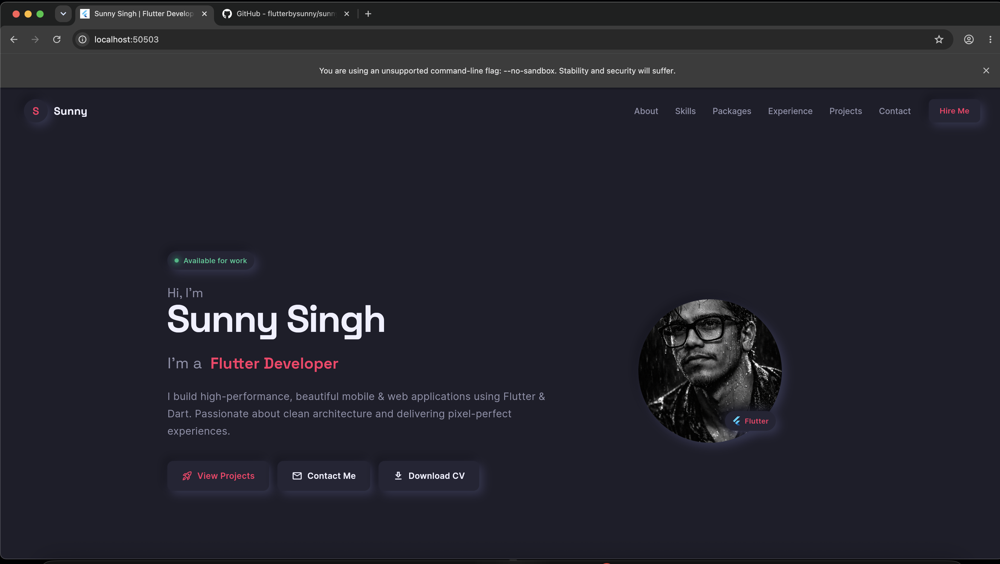
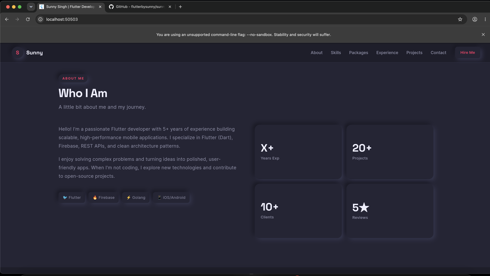
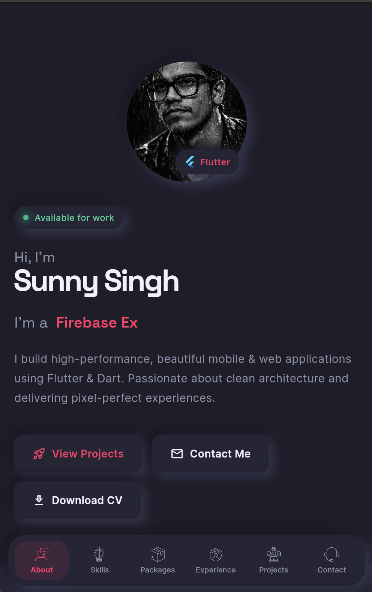
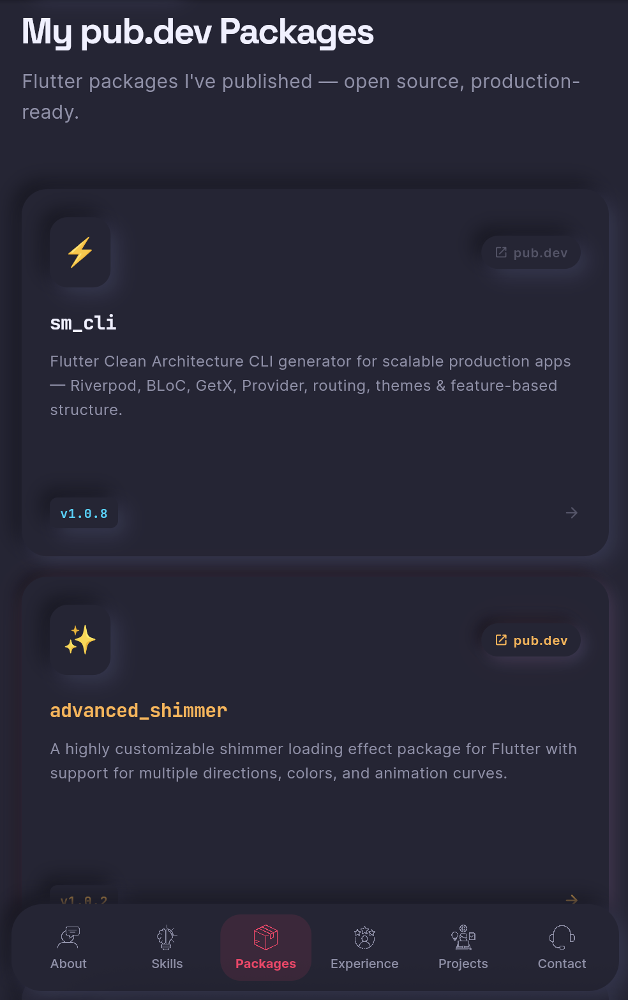
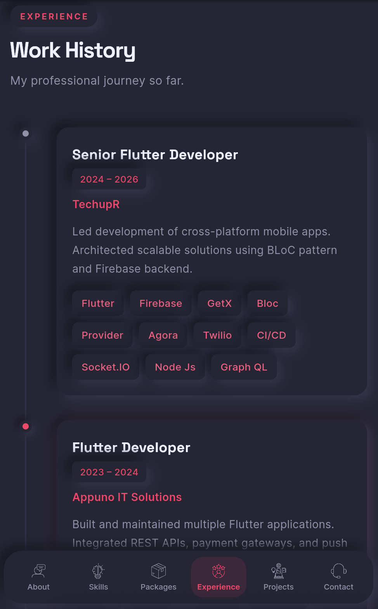

# 🚀 Flutter Portfolio — Web & Mobile

A beautiful, responsive personal portfolio built with Flutter. Works on **Web, Android, and iOS** from a single codebase.

---

## ✨ Features
- 🌙 Dark neumorphic theme with soft shadows & raised/pressed effects
- 📱 Fully responsive (mobile, tablet, desktop)
- 🎭 Smooth animations & hover effects
- ⌨️ Animated typing text in Hero section
- 📍 Timeline for Experience section
- 🃏 Hover-lift Project cards with Play Store / App Store links
- 📦 Packages showcase section (pub.dev)
- 🧭 Smooth scroll navigation
- 🧭 Top navbar on Web/Desktop, bottom app bar on Mobile
- 🌐 Web-ready with Flutter Web support

---

## 📁 Project Structure

```
lib/
├── main.dart                    # App entry point
├── theme/
│   └── app_theme.dart           # Colors, typography, NeuBox
├── models/
│   └── portfolio_data.dart      # ⭐ YOUR DATA GOES HERE
├── utils/
│   └── responsive.dart          # Breakpoints & helpers
├── widgets/
│   ├── common_widgets.dart      # Reusable components
│   └── navbar.dart              # Top navbar (web) + Bottom nav bar (mobile)
└── screens/
    ├── portfolio_page.dart      # Main scaffold
    ├── hero_section.dart        # Landing / Hero
    ├── about_section.dart       # About + Stats
    ├── skills_section.dart      # Tech stack grid
    ├── packages_section.dart    # pub.dev packages showcase
    ├── experience_section.dart  # Work history timeline
    ├── projects_section.dart    # Project cards
    └── contact_section.dart     # Contact + Footer
```

---

## 🛠 Setup

### 1. Install Flutter
```bash
flutter --version   # should be 3.x+
```

### 2. Install Dependencies
```bash
cd flutter_portfolio
flutter pub get
```

### 3. Run on Mobile
```bash
flutter run
```

### 4. Run on Web
```bash
flutter run -d chrome
```

### 5. Build for Web (Deploy)
```bash
flutter build web --release
# Output in: build/web/
# Deploy to: Firebase Hosting / Vercel / Netlify
```

### 6. Deploy to Vercel
```bash
npm i -g vercel
cd build/web
vercel --prod
```

### 7. Deploy to Firebase Hosting
```bash
npm i -g firebase-tools
firebase login
firebase init hosting
# Public directory: build/web
flutter build web --release
firebase deploy
```

---

## ✏️ Customize Your Data

**Open `lib/models/portfolio_data.dart` and update:**

```dart
static const String name = "Your Real Name";
static const String email = "you@email.com";
static const String phone = "+91 0000000000";
static const String github = "https://github.com/yourhandle";
static const String linkedin = "https://linkedin.com/in/yourhandle";
static const String twitter = "https://twitter.com/yourhandle";
static const String whatsapp = "https://wa.me/910000000000";
static const String resumeUrl = "https://your-resume-link.com";
```

- **Profile / Contact Images** → `profileImage`, `contactImage` (place files in `assets/images/`)
- **Stats** → `stats` list (Years, Projects, Clients, Rating)
- **About** → `aboutText` string
- **Skills** → `skills` list (categories + tech chips)
- **Experience** → `experience` list (company, role, duration, description)
- **Projects** → `projects` list (title, desc, tags, emoji, links, `playStoreUrl`, `appStoreUrl`)
- **Packages** → `packages_section.dart` → update the `_packages` list with your own pub.dev packages

---

## 🔗 URL Launcher

Already wired up across Contact, Projects, and Packages sections using `url_launcher`:

```dart
import 'package:url_launcher/url_launcher.dart';

Future<void> _launch(String url) async {
  final uri = Uri.parse(url);
  if (await canLaunchUrl(uri)) {
    await launchUrl(uri, mode: LaunchMode.externalApplication);
  }
}
```

---

## 🎨 Theme & Neumorphism

In `lib/theme/app_theme.dart`:

```dart
static const Color primary    = Color(0xFFFF3366); // Accent — change to your color
static const Color background = Color(0xFF1E1E2A); // Base background
static const Color card        = Color(0xFF252535); // Card surface
static const Color neuDark     = Color(0xFF15151F); // Dark shadow
static const Color neuLight    = Color(0xFF353550); // Light shadow
```

All cards use the shared `NeuBox` widget — pass `isPressed: true` for the recessed/inset look (used on hover and form fields).

---

## 📦 Dependencies

| Package | Use |
|---------|-----|
| `google_fonts` | Space Grotesk + Inter + JetBrains Mono typography |
| `animated_text_kit` | Typing animation in Hero |
| `url_launcher` | Open links (social, projects, stores, packages) |
| `flutter_svg` | SVG support |
| `font_awesome_flutter` | Social icons |

---

## 🚀 Deploy

| Platform | Command |
|----------|---------|
| Firebase | `firebase deploy` |
| Vercel | `vercel build/web --prod` |
| Netlify | Drag `build/web` to Netlify |

---

## 📸 Screenshots

### 🖥 Desktop View

<p>
  
</p>
<p>
  
</p>

### 📱 Mobile View

<p>
  
  
  
</p>

---

## ☕ Support

If this template helped you save time, consider buying me a coffee!

<a href="https://buymeacoffee.com/smtechviral" target="_blank">
  
</a>

[buymeacoffee.com/smtechviral](https://buymeacoffee.com/smtechviral)

---

Built with 💙 Flutter